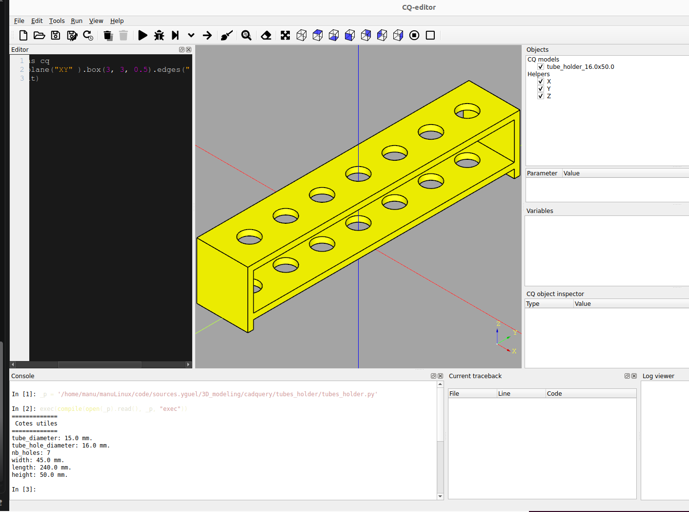

#############
Installation
#############

Install using uv

.. code-block:: bash

   uv install

###################
Running the Script
###################

Copy the path of the current folder of this file in your copy-paste buffer:

.. code-block:: bash

   pwd

Launch cq-editor:

.. code-block:: bash

   uv run cq-editor

In the console of cq-editor define a python variable ``_p`` with the path of the current folder of this file (paste the content of your buffer1)

.. code-block:: python

   _p = '/path/to/project/folder' + "/tubes_holder.py"

Then run the following command also in the cq-editor console:

.. code-block:: python

   exec(compile(open(_p).read(), _p, "exec"))

##########
3D Models
##########

The rendered 3D model should now appear in the cq-editor viewport.
And the script should have created step and STL files of the 3D model in the project folder under the `exports/models folder <https://github.com/yguel/tubes_holder/tree/main/exports/models>`_ directory.

###################
Play with the code
###################

It is super easy to modify the parameters in `tubes_holder__parameters.py` stored in the class `TubeHolder` and see the changes reflected in the 3D model.
If you want less holes, walls with different thickness, or other modifications, simply edit the corresponding parameters in `tubes_holder__parameters.py` and re-run the script in cq-editor.

.. literalinclude:: tubes_holder__parameters.py
   :language: python
   :caption: Tubes holder parameters
   :linenos:

The names of the parameters should be self-explanatory.
